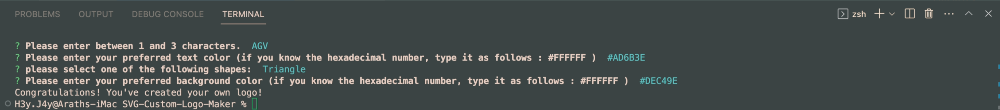
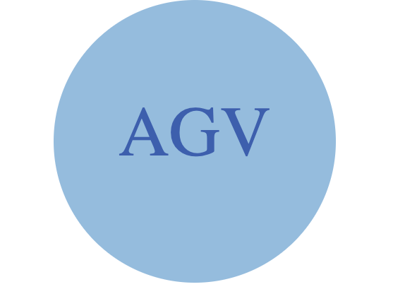
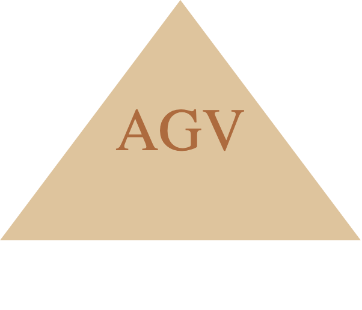

  # SVG-Custom-Logo-Maker 

  ### Table of Contents

  - [Description](#description)
  - [Packages](#packages)
  - [Installation](#installation)
  - [Usage](#usage)
  - [Credits](#credits)
  - [License](#license)
  - [Tests](#tests)
  - [Contact](#contact)

  ## Description
  This helps the user create their own monogram logo within their own time thanks to the help of this application. With the help of `Inquirer`, the user will be asked to answer questions to determine how they would like their logo to look like, like what letters they want to use (up to 3) to what colors they would like, and what shape to use (circle, square, or triangle). Once all questions have been answered, an SVG file will have been created, containing the users brand new logo!

  ## Packages
  this application uses the following tools:
  `inquirer 8.2.4` and 
  `jest 29.7.0`

  ## Installation
  1. Download the repository for the application at https://github.com/H3yJ4yy/SVG-Custom-Logo-Maker, and make sure you have Visual Studio Code installed.
  2. Open the application on VS Code, and in the integrated terminal install node.js v16.
  3. Using the integrated terminal, type in `npm init -y` to initiate the application.
  4. Using the integrated termional, type `npm i inquirer@8.2.4` to install the inquirer package. Then typoe in `npm i --save-dev jest` to install Jest (allows us to test out application from bugs)
  5. Once everything is installed, type in the integrated terminal `npm start` to run the application.
  6. Once the application starts, answer the following questions as prompted. 
  7. Once finished, a `logo.svg` file will be created. 
  8. To view the logo, drag the file into a blank Google Crome tab, and the logo will be shown.

  ## Usage
 this application will allow the user to create their own custom logos either in the shape of a circle, triangle, or square. 

  ## Credits
 This was done with the help of my instrustor Tyler and my tutor Corey Yates
  
  ## License
  MIT License 
 
  ## Tests
  

  

  

  

  

  ## Contact 
  For any further questions, feel free to contact me through my GitHub [H3yJ4yy](https://github.com/H3yJ4yy) or Email [agon0015@gmail.com](mailto:agon0015@gmail.com).
